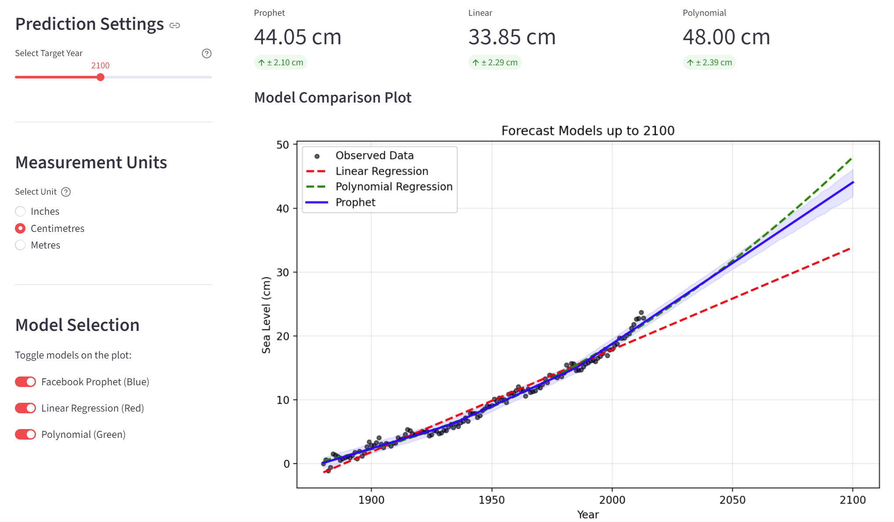

# 🌊 Sea Level Predictor & Model Comparison

An interactive web application that forecasts global sea level rise by comparing three distinct statistical models: **Facebook Prophet**, **Linear Regression**, and **Polynomial Regression**.

Unlike simple trend lines, this app allows users to visualise how different mathematical approaches diverge when predicting the future of our oceans.

[](https://sea-level-app-faqqps9amzyqpcsoxntfb4.streamlit.app/)


## 🚀 Live Demo

**[Click here to launch the App](https://sea-level-app-faqqps9amzyqpcsoxntfb4.streamlit.app/)**

 

## 🧐 What does this app do?

This application takes historical sea level data (1880–Present) and allows users to:
1.  **Visualise History:** See the raw EPA/CSIRO data points.
2.  **Compare Models:** See three different forecasts side-by-side:
    * **Linear Regression (Red):** A simple straight-line projection.
    * **Polynomial Regression (Green):** A quadratic curve that accounts for acceleration.
    * **Facebook Prophet (Blue):** A complex machine-learning model with confidence intervals.
3.  **Interact:** Use the main slider to adjust the prediction year (up to 2100) and toggle switches to filter which models are displayed on the graph.

## 📊 The Three Models Explained

The app helps visualise why model selection matters:

| Model | Type | What it assumes |
| :--- | :--- | :--- |
| **Linear Regression** | Simple Statistic | Sea levels rise at a constant, unchanging rate. (Often under-predicts). |
| **Polynomial (Deg 2)** | Quadratic | Sea level rise is accelerating over time (curved line). |
| **Facebook Prophet** | Time-Series ML | Captures non-linear trends, seasonality, and provides a "cone of uncertainty" (confidence interval). |

## 🛠️ Tech Stack

* **Streamlit**: For the interactive web interface and caching.
* **Prophet**: For the machine learning time-series forecasting.
* **Scipy**: For calculating the Linear Regression.
* **Numpy**: For calculating the Polynomial Regression.
* **Pandas**: For data manipulation.
* **Matplotlib**: For plotting the comparative graph.

## 💻 How to Run Locally

If you want to run this code on your own machine:

1.  **Clone the repository:**
    ```bash
    git clone https://github.com/sahmed0/sea-level-app.git
    cd sea-level-app
    ```

2.  **Install dependencies:**
    ```bash
    pip install -r requirements.txt
    ```

3.  **Run the App:**
    ```bash
    streamlit run app.py
    ```

## 📂 Project Structure

* `app.py`: The main application code containing the UI, caching logic, and model calculations.
* `requirements.txt`: List of Python libraries required for Streamlit Cloud.
* `epa-sea-level.csv`: The historical dataset.

## 📉 Data Source
Global Average Absolute Sea Level Change, 1880-2014 from the US Environmental Protection Agency using data from CSIRO, 2015; NOAA, 2015.
