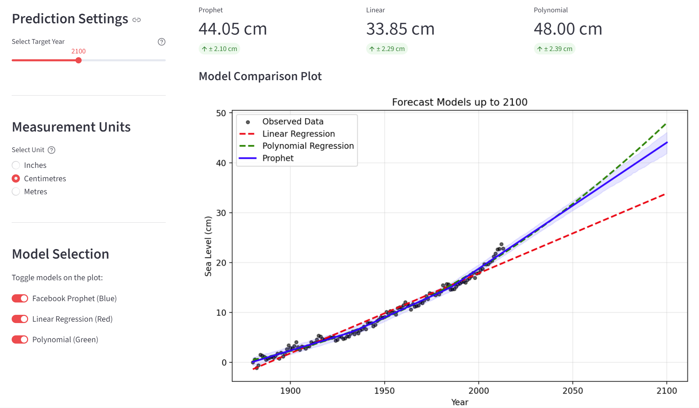
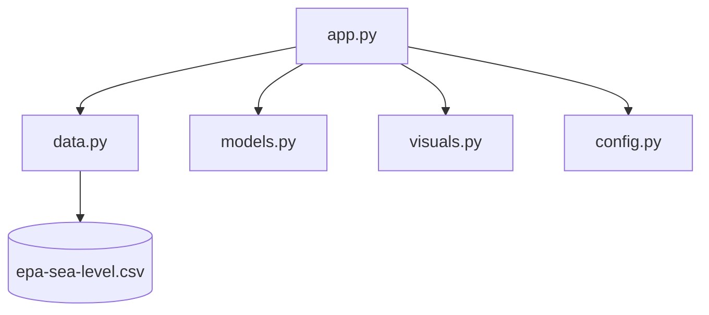

# 🌊 Sea Level Forecasting & Model Comparison

An interactive web application that forecasts global sea level rise by comparing three distinct statistical models: **Facebook Prophet**, **Linear Regression**, and **Polynomial Regression**.

Unlike simple trend lines, this app allows users to visualise how different mathematical approaches diverge when predicting the future of our oceans.

[](https://www.gnu.org/licenses/gpl-3.0)


## ⏯️ **[Click to use the App](https://sajidahmed.co.uk/sea-level-app)**

**Note: on first access, it may take few seconds for Streamlit to build the app in your browser**

 

## What does this app do?

This application takes historical sea level data (1880–Present) and allows users to:
1.  **Visualise History:** See the raw EPA/CSIRO data points.
2.  **Compare Models:** See three different forecasts side-by-side:
    * **Linear Regression (Red):** A simple straight-line projection.
    * **Polynomial Regression (Green):** A quadratic curve that accounts for acceleration.
    * **Facebook Prophet (Blue):** A complex machine-learning model with confidence intervals.
3.  **Interact:** Use the main slider to adjust the prediction year (up to 2200) and toggle switches to filter which models are displayed on the graph.

## The Three Models Explained

The app helps visualise why model selection matters:

| Model | Type | What it assumes |
| :--- | :--- | :--- |
| **Linear Regression** | Simple Statistic | Sea levels rise at a constant, unchanging rate. (Often under-predicts). |
| **Polynomial (Deg 2)** | Quadratic | Sea level rise is accelerating over time (curved line). |
| **Facebook Prophet** | Time-Series ML | Captures non-linear trends, seasonality, and provides a "cone of uncertainty" (confidence interval). |

## Tech Stack

* **Streamlit**: For the interactive web interface and caching.
* **Prophet**: For the machine learning time-series forecasting.
* **Scipy**: For calculating the Linear Regression.
* **Numpy**: For calculating the Polynomial Regression.
* **Pandas**: For data manipulation.
* **Matplotlib**: For plotting the comparative graph.

## How to Run Locally

If you want to run this code on your own machine:

1.  **Clone the repository:**
    ```bash
    git clone https://github.com/sahmed0/sea-level-app.git
    cd sea-level-app
    ```

2.  **Install dependencies:**
    ```bash
    pip install -r requirements.txt
    ```

3.  **Run the App:**
    ```bash
    streamlit run app.py
    ```

## Project Architecture


```mermaid
graph TD
    A[app.py] --> B[data.py]
    A --> C[models.py]
    A --> D[visuals.py]
    A --> E[config.py]
    B --> F[(epa-sea-level.csv)]
```

*   `app.py`: The UI orchestrator. Manages layout, user input, and component state.
*   `data.py`: Data ingestion layer. Handles loading and caching of the historical dataset.
*   `models.py`: Forecasting logic. Includes Prophet, Linear, and Polynomial regression models.
*   `visuals.py`: Plotting module. Generates Matplotlib figures for the UI.
*   `config.py`: Global configuration and shared constants.
*   `epa-sea-level.csv`: Historical dataset (1880–Present).
*   `requirements.txt`: Python dependencies.

## Data Source
Global Average Absolute Sea Level Change, 1880-2014 from the US Environmental Protection Agency using data from CSIRO, 2015; NOAA, 2015.

---

## License
[](https://www.gnu.org/licenses/gpl-3.0)

Copyright © 2026 Sajid Ahmed

This program is free software: you can redistribute it and/or modify it under the terms of the **GNU General Public License** as published by the Free Software Foundation, either version 3 of the License, or (at your option) any later version.

This program is distributed in the hope that it will be useful, but **WITHOUT ANY WARRANTY**; without even the implied warranty of **MERCHANTABILITY** or **FITNESS FOR A PARTICULAR PURPOSE**. 

See the [LICENSE](LICENSE) file for more details.
